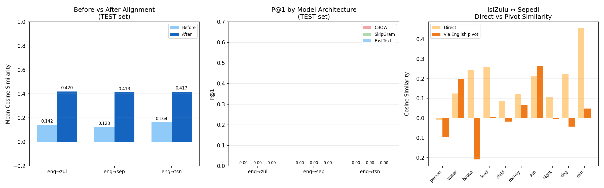
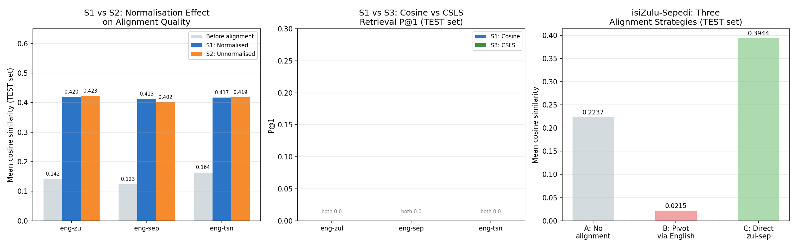
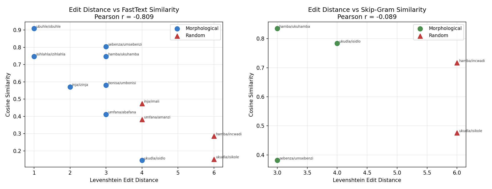
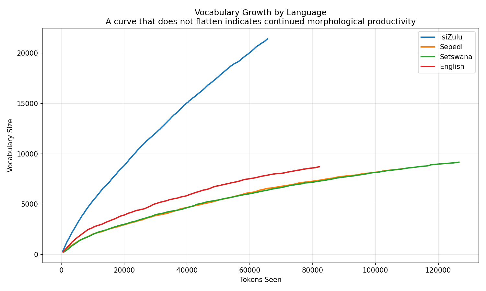

# Optimizing Cross-Lingual Embeddings for isiZulu, Sepedi, and Setswana

**Alignment Strategies, Pivot Selection, and Morphological Challenges**

**Group 48** | Sinenhlahla Nkosi & Zukisa Nxesi
**University of Pretoria** | COS760 Natural Language Processing | 31 May 2026

---

## What This Project Does

South Africa has eleven official languages but most NLP tools only work well for English. This project asks a straightforward question: can we build cross-lingual word embeddings that connect isiZulu, Sepedi, and Setswana to each other and to English, using only the data we actually have?

The short answer is: partially, and the reasons why it only partially works are themselves the finding.

We train word embedding models for all four languages on the Vukuzenzele government newsletter corpus, align the independently trained spaces using orthogonal Procrustes mapping, and then test five different alignment strategies including a direct Bantu-to-Bantu approach that turns out to work substantially better than routing through English.

> **Development environment:** This project was developed and run entirely on Google Colab with files stored on Google Drive. All paths in the notebook are absolute Google Drive paths. You will need to mount your own Google Drive and place the corpus files in the expected location before running.

---

## Key Findings

> **Most important result:** Routing isiZulu-Sepedi comparison through English as a pivot collapses similarity to near zero (0.022). A direct rotation between the two Bantu languages produces 0.394 mean similarity on held-out test pairs, outperforming the English pivot by a factor of 18.

| Finding | Result |
|:---|:---|
| FastText morphological gap over random pairs | **+0.291** |
| Spearman correlation: edit distance vs FastText similarity | **-0.799** (p = 0.002) |
| Alignment improvement on held-out test pairs | 0.12-0.16 to 0.41-0.42 |
| Train vs test overfitting gap | 0.42-0.46 |
| Word translation P@1 across all conditions | 0.000 |
| English pivot: isiZulu-Sepedi similarity | 0.022 |
| Direct isiZulu-Sepedi alignment | **0.394** |

---

## Results at a Glance

### Before and After Alignment



### All Five Alignment Strategies Compared



### FastText Mechanism: Edit Distance vs Similarity



### Vocabulary Growth Curves



---

## Repository Contents

### notebooks/

| File | Description |
|:---|:---|
| `NLP-Project-1.ipynb` | Main project notebook. Note: GitHub does not preview `.ipynb` files. Download and open in Google Colab to view and run. |
| `NLP-Project-PDF-Version.pdf` | PDF export of the notebook with all outputs visible. Open this directly in GitHub to read through the full experiment. |
| `nlp_project_1.py` | Python script version of the notebook code. Fully readable in GitHub. |

### evaluation/

Contains all figures generated by the notebook. See the Output Files section below for the full list.

### logs/

Contains all CSV result files and the experiment log JSON generated by the notebook. See the Output Files section below for the full list.

### models/ - Not Included

> **Note:** The trained embedding models and rotation matrices are not included in this repository. The model files are several hundred megabytes each and exceed GitHub's file size limits. They are generated automatically when you run the notebook from top to bottom on the corpus. The rotation matrix files (`W_eng_zul.npy`, `W_eng_sep.npy`, `W_eng_tsn.npy`, `W_zul_sep.npy`) are also generated automatically and saved to your Google Drive.

---

## Corpus

All models are trained on the Vukuzenzele South African government newsletter accessed via the OPUS parallel corpus collection. The corpus covers civic topics: government services, health, education, and rights.

| Language | Files | Sentences | Tokens | Vocabulary | TTR |
|:---|---:|---:|---:|---:|---:|
| isiZulu | 118 | 3,835 | 64,270 | 21,052 | 0.326 |
| Sepedi | 117 | 3,817 | 107,743 | 8,188 | 0.076 |
| Setswana | 116 | 3,771 | 125,213 | 8,824 | 0.070 |
| English | 118 | 3,900 | 80,711 | 8,359 | 0.104 |

> **Note on isiZulu sparsity:** isiZulu has a hapax ratio of 0.665, meaning two-thirds of its vocabulary types appear exactly once in the corpus. This is not a small difference from the other languages. It is a qualitatively different sparsity regime driven by agglutinative morphological productivity, and it drives every downstream result in this project.

---

## How to Run the Notebook

### Requirements

| Requirement | Detail |
|:---|:---|
| Python | 3.10 or higher |
| Environment | Google Colab (strongly recommended, project was built here) |
| Storage | Google Drive with corpus files placed in the correct location |

### Install Dependencies

```bash
pip install gensim>=4.3 numpy>=1.24 pandas>=2.0 \
            matplotlib>=3.7 scipy>=1.11 \
            scikit-learn>=1.3 python-Levenshtein>=0.21
